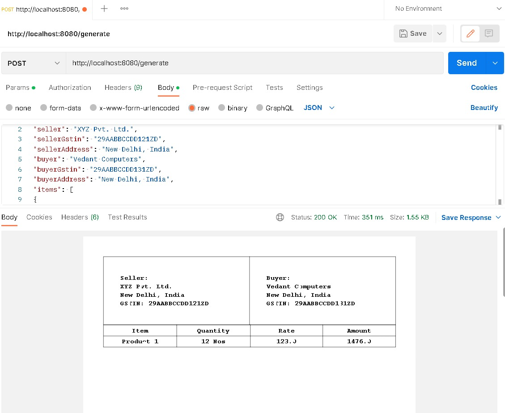

# Dynamic PDF Generation

A Spring Boot application with REST API can be developed to generate PDF files using iText, an open-source Java library that supports the development and conversion of PDF documents. In this tutorial, we will learn how to use iText to develop Java programs that can create, convert, and manipulate PDF documents.
## Request
POST http://localhost:8080/generate

  

